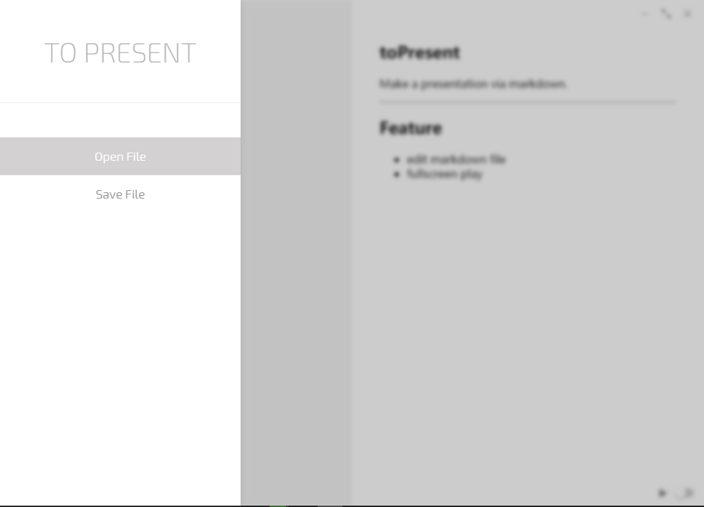
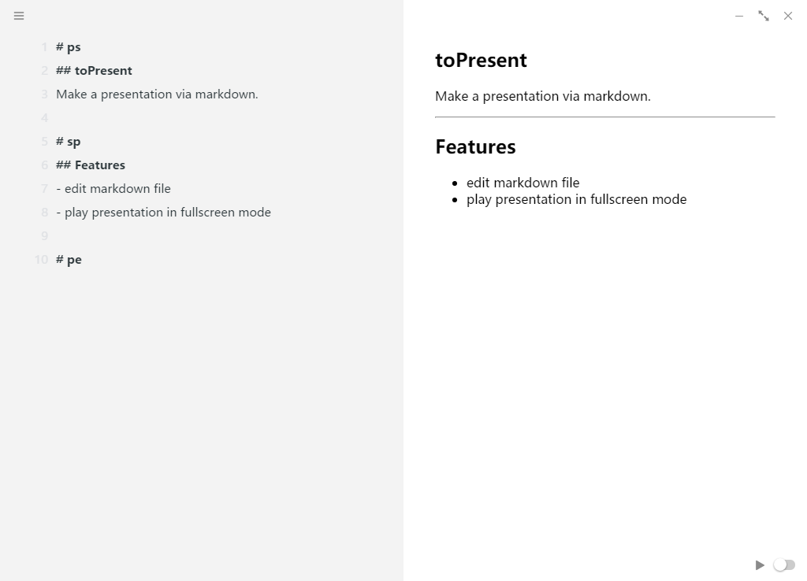
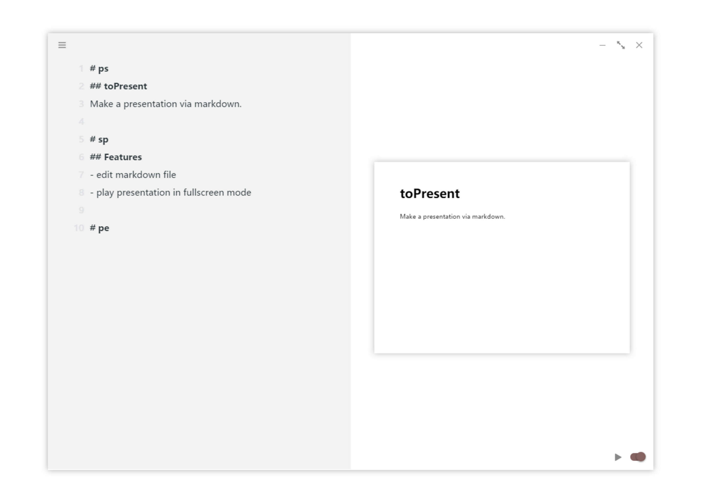

# toPresent   
Use markdown file to take a presentation.

- Feature   
    - edit markdown file
    - play presentation in fullscreen mode
    - export presentation to hmtl
    - use your presentation css style

- ScreenShots   

